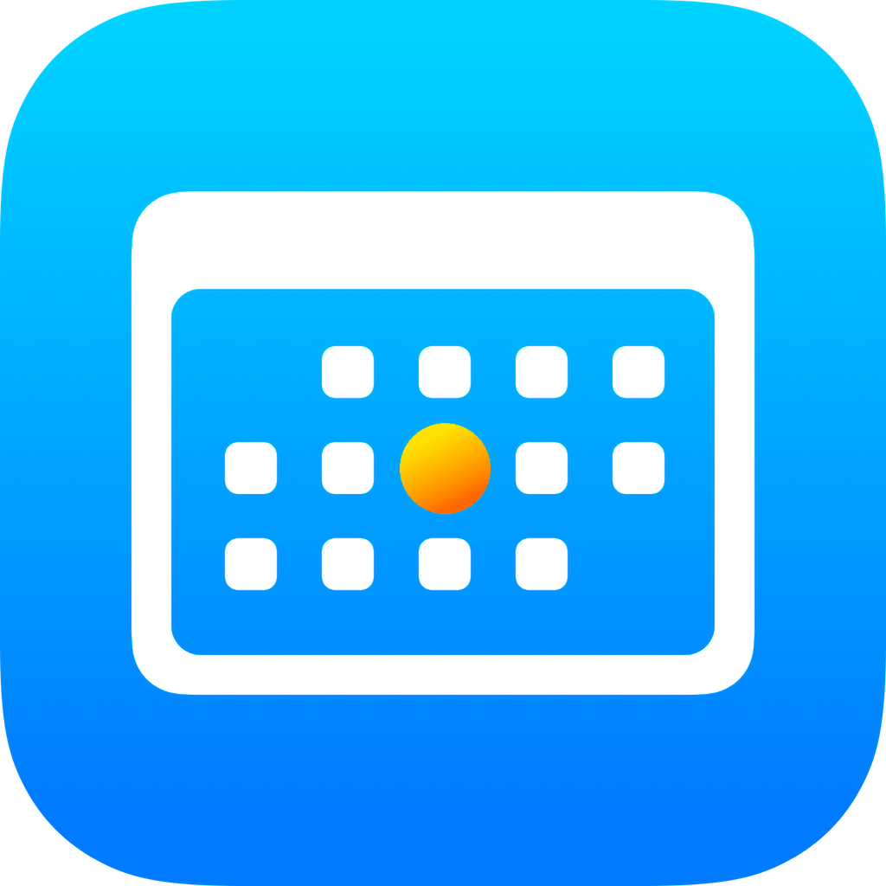

# Day-One-iOS
"Day One" is an iOS app designed to help people celebrate and focus on a big day in their lives. This big day, "Day One", could be a wedding, a first day at work, a college graduation, or even a sobriety anniversary. Day One helps to track the time until &amp; since the big event. The Day One app also includes a Today View app extension.

This app is designed using Xcode 9 and implemented in Objective-C. It utilizes the Core Spotlight and User Notifications frameworks to create a robust user experience. Future versions will use CloudKit to synchronize data between iOS devices.

#### All of Day One's source code was originally public on this repository with a fair use license, but unfortunately, two individuals copied the entire repository and put identical, plagiarized apps on the App Store. To this end, I have moved all code to a private repository.

  

  
  

    

